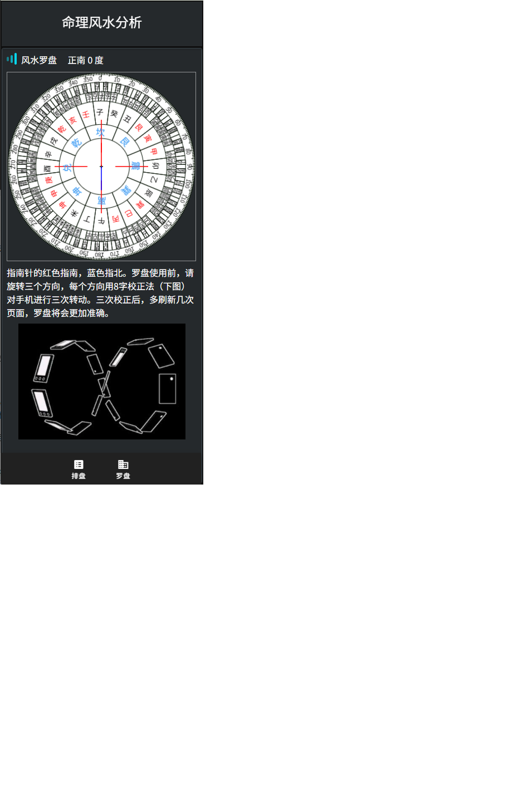
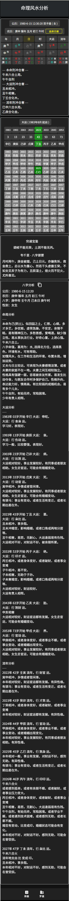

# 八字排盘和罗盘软件前端

[后端代码](https://github.com/ddfj0/bz_server.git)

局主天干　甲　　乙 　丙　 丁　 戊　 己　 庚　 辛　 壬　 癸   
甲 　　　比肩 劫财 偏印 正印 七杀 正官 偏财 正财 食神 伤官   
乙 　　　劫财 比肩 正印 偏印 正官 七杀 正财 偏财 伤官 食神   
丙 　　　食神 伤官 比肩 劫财 偏印 正印 七杀 正官 偏财 正财   
丁 　　　伤官 食神 劫财 比肩 正印 偏印 正官 七杀 正财 偏财   
戊 　　　偏财 正财 食神 伤官 比肩 劫财 偏印 正印 七杀 正官   
己 　　　正财 偏财 伤官 食神 劫财 比肩 正印 偏印 正官 七杀   
庚 　　　七杀 正官 偏财 正财 食神 伤官 比肩 劫财 偏印 正印   
辛 　　　正官 七杀 正财 偏财 伤官 食神 劫财 比肩 正印 偏印   
壬 　　　偏印 正印 七杀 正官 偏财 正财 食神 伤官 比肩 劫财   
癸 　　　正印 偏印 正官 七杀 正财 偏财 伤官 食神 劫财 比肩   
地支十神表   
局主地支　甲　　乙 　丙　 丁　 戊　 己　 庚　 辛　 壬　 癸   
子 　　　正印 偏印 正官 七杀 正财 偏财 伤官 食神 劫财 比肩   
丑 　　　正财 偏财 伤官 食神 劫财 比肩 正印 偏印 正官 七杀   
寅 　　　比肩 劫财 偏印 正印 七杀 正官 偏财 正财 食神 伤官   
卯　　　 劫财 比肩 正印 偏印 正官 七杀 正财 偏财 伤官 食神   
辰　　　 偏财 正财 食神 伤官 比肩 劫财 偏印 正印 七杀 正官   
巳　　　 伤官 食神 劫财 比肩 正印 偏印 正官 七杀 正财 偏财   
午　　　 食神 伤官 比肩 劫财 偏印 正印 七杀 正官 偏财 正财   
未　　　 正财 偏财 伤官 食神 劫财 比肩 正印 偏印 正官 七杀   
申　　　 七杀 正官 偏财 正财 食神 伤官 比肩 劫财 偏印 正印   
酉　　　 正官 七杀 正财 偏财 伤官 食神 劫财 比肩 正印 偏印   
戌　　　 偏财 正财 食神 伤官 比肩 劫财 偏印 正印 七杀 正官   
亥　　　 偏印 正印 七杀 正官 偏财 正财 食神 伤官 比肩 劫财   

